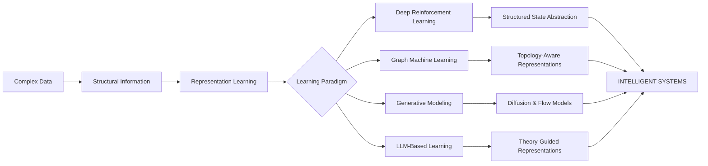
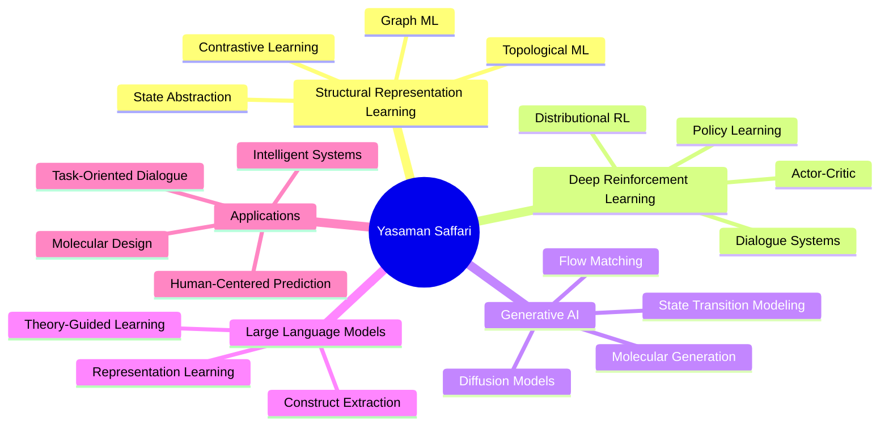

<div align="center">


<br/>

# Yasaman Saffari

### PhD Researcher in Artificial Intelligence

**Topological Machine Learning · Structural Representation Learning · Graph ML · Generative AI · Deep Reinforcement Learning**

<br/>

<a href="https://yasamansaffarii.github.io">

</a>
<a href="https://scholar.google.com/">

</a>
<a href="https://www.linkedin.com/">

</a>
<a href="https://github.com/yasamansaffarii">

</a>

<br/><br/>


</div>

---

# 🧭 Research at a Glance

<div align="center">

```text
                           ARTIFICIAL INTELLIGENCE
                                    │
                  ┌─────────────────┼─────────────────┐
                  │                 │                 │
                  ▼                 ▼                 ▼
             STRUCTURE          LEARNING          GENERATION
                  │                 │                 │
          ┌───────┴───────┐   ┌─────┴─────┐   ┌─────┴─────┐
          │               │   │           │   │           │
       Topology         Graphs  Deep RL   LLMs Diffusion  Flow
          │               │       │         │      │       │
          └───────────────┼───────┼─────────┼──────┘       │
                          │       │         │              │
                          ▼       ▼         ▼              ▼
                    REPRESENTATION LEARNING
                              │
                              ▼
                    STRUCTURED INTELLIGENCE
```

</div>

<br/>

> **Research focus:** developing machine learning methods that do not merely learn from observations, but explicitly exploit the **structure, topology, relations, and latent organization** underlying complex data.

My research sits at the intersection of:

`Topological ML` · `Graph Representation Learning` · `Deep Reinforcement Learning` · `Generative Modeling` · `LLMs` · `Interpretable AI`

---

# 🧬 The Research Question

A recurring question across my work is:

> ### **How can an intelligent system learn representations that preserve the structure of the world it is trying to model?**

This question appears in different forms across my research:

| Domain        | Structural Question                                 | Learning Problem                      |
| ------------- | --------------------------------------------------- | ------------------------------------- |
| 🗣️ Dialogue  | How should dialogue states be structured?           | RL state representation               |
| 🕸️ Graphs    | How can relational structure be preserved?          | Graph representation learning         |
| 🧪 Molecules  | How should molecular topology constrain generation? | Graph generative modeling             |
| 🧠 Psychology | How can theoretical constructs guide embeddings?    | Theory-guided representation learning |
| 🌊 Dynamics   | How can state transitions be modeled continuously?  | Flow-based generative modeling        |

The common thread is **structure-aware representation learning**.

---

# 🔬 Research Architecture



---

# 🕸️ Research Pillars

<table>
<tr>

<td width="25%" align="center">

## 🧬

### Topological ML

Topology-aware representations, structural signals, state abstraction, connectivity, and higher-order structure.

</td>

<td width="25%" align="center">

## 🕸️

### Graph ML

Graph representations, graph-based state modeling, relational learning, and structured prediction.

</td>

<td width="25%" align="center">

## 🌊

### Generative AI

Diffusion models, flow matching, graph generation, molecular generation, and generative state modeling.

</td>

<td width="25%" align="center">

## 🧠

### Intelligent Systems

Deep RL, dialogue systems, LLMs, interpretable learning, and task-oriented decision making.

</td>

</tr>
</table>

---

# 🧠 01 — Structural Representation Learning

### The core research direction

A major focus of my work is the development of representations that explicitly encode **relationships and structure** rather than relying solely on independent feature dimensions.

```text
Raw Observations
       │
       ▼
┌──────────────────────┐
│ Structural Analysis  │
│                      │
│ • relations          │
│ • topology           │
│ • connectivity       │
│ • state structure    │
└──────────┬───────────┘
           │
           ▼
┌──────────────────────┐
│ Learned Representation│
└──────────┬───────────┘
           │
           ▼
┌──────────────────────┐
│ Downstream Learning  │
│                      │
│ RL / Prediction /    │
│ Generation / Search  │
└──────────────────────┘
```

### Research interests

* Structural representation learning
* Topological state representations
* Graph-based state abstraction
* Representation transfer
* Task-oriented representations
* Interpretable latent spaces
* Structure-aware contrastive learning

---

# 🗣️ 02 — Graph-Based Reinforcement Learning for Dialogue

## PhD Research

### *Graph-Based State Representation Learning for Task-Oriented Dialogue Systems*

**PhD · Artificial Intelligence · Kashan University · 2020–2026**

The doctoral research investigates how **graph-based and topological representations** can be used to improve state representation and policy learning in task-oriented dialogue systems.

### Conventional formulation

```text
Dialogue History
       │
       ▼
Flat State Vector
       │
       ▼
Policy Network
       │
       ▼
Action
```

### Structural formulation

```text
Dialogue History
       │
       ▼
┌─────────────────────┐
│ Graph-Based State   │
│ Representation      │
│                     │
│ entities            │
│ relations           │
│ topology             │
│ state structure      │
└──────────┬──────────┘
           │
           ▼
     State Abstraction
           │
           ▼
      Policy Learning
           │
           ▼
          Action
```

### Key directions

* Graph-based dialogue state representation
* Topological state abstraction
* Episodic reinforcement learning
* Distributional actor-critic methods
* Hierarchical attention
* Dialogue policy learning
* State-space compression
* Structural progress signals

### Selected doctoral components

**TopoStack**

A topological/structural representation pipeline for dialogue state modeling.

**GSDP-DQN**

A graph-based state representation approach for dialogue policy learning.

**Topological progress signals**

Using structural changes in the state representation as additional learning signals.

---

# 📊 Research Evidence

Where supported by the corresponding experiments, the doctoral research investigated:

```text
                STRUCTURED STATE SPACE

                  ┌─────────────┐
                  │ Raw States  │
                  └──────┬──────┘
                         │
                         ▼
                  Graph / Topology
                         │
                         ▼
                  ┌─────────────┐
                  │ Abstracted   │
                  │ State Space  │
                  └──────┬──────┘
                         │
             ┌───────────┴───────────┐
             ▼                       ▼
       Better Learning          Smaller Search
       Signals                  / State Space
```

The resulting research has produced peer-reviewed work in **Engineering Applications of Artificial Intelligence** and **Knowledge-Based Systems**.

---

# 📚 03 — Selected Publications

## ⭐ Published

### A Graph-Based State Representation Learning in Episodic RL for Task-Oriented Dialogue Systems

**Engineering Applications of Artificial Intelligence · 2025**

Research on graph-based state representations for episodic reinforcement learning in task-oriented dialogue systems.

---

### CODACAN: Distributional Actor-Critic with Hierarchical Attention-based State Representation for Dialogue Policy Learning

**Knowledge-Based Systems · 2025**

Research combining distributional actor-critic learning with hierarchical attention-based state representation for dialogue policy learning.

---

### Actor Double Critic Architecture for Dialogue System

**Journal of Electrical and Computer Engineering Innovations · 2023**

Research on actor-critic architectures for dialogue policy learning.

---

## 🔭 Under Review / In Preparation

### Topology Meets Policy

**Inductive State Abstraction for Reinforcement Learning in Dialogue Systems**

Focus:

`Topology → State Abstraction → Policy Learning`

---

### Topologically-Guided Diffusion

**Topologically-Guided Diffusion for Graph-Structured Molecular Generation**

Focus:

`Molecular Graphs → Structural Constraints → Diffusion → Generation`

---

### Flow Matching for Dialogue State Transitions

**Flow Matching for Generative Modeling of Dialogue State Transitions**

Focus:

`Dialogue States → Continuous Dynamics → Generative Transition Model`

---

### PsyGuide-LLM

**Theory-Guided Contrastive Representation Learning for Interpretable Burnout and Attrition-Risk Prediction**

Focus:

`Psychological Theory → LLM → Theory Space → Contrastive Learning → Prediction`

---

# 🧪 04 — Graph-Guided Molecular Generation

## Structural Constraints × Generative Models

A research direction investigating how **graph structure and topological information** can guide generative models for molecular design.

```text
                 MOLECULAR GRAPH
                       │
                       ▼
              Structural Encoding
                       │
             ┌─────────┴─────────┐
             │                   │
             ▼                   ▼
          Graph                 Topology
          Features              Signals
             │                   │
             └─────────┬─────────┘
                       ▼
              Generative Process
                       │
             ┌─────────┴─────────┐
             ▼                   ▼
        Diffusion             Sampling
             │                   │
             └─────────┬─────────┘
                       ▼
                New Molecules
```

### Research interests

* Graph-conditioned diffusion
* Topology-aware generation
* Molecular graph validity
* Structural constraints
* Conditional generation
* Generative representation learning

**Status:** Ongoing

---

# 🌊 05 — Flow Matching

## Modeling State Transitions as Continuous Dynamics

Another research direction investigates whether **flow matching** can provide a principled framework for generative modeling of dialogue state transitions.

```text
      Stateₜ
        │
        │
        │       learned vector field
        ▼              ↓
   ┌─────────────────────────┐
   │     Continuous Flow     │
   │                         │
   │   latent transition     │
   │         dynamics        │
   └─────────────────────────┘
                 │
                 ▼
              Stateₜ₊₁
```

The broader goal is to connect:

**representation learning + structured dynamics + generative modeling**

for intelligent sequential systems.

---

# 🧠 06 — PsyGuide-LLM

## Theory-Guided Representation Learning

**PsyGuide-LLM** explores how domain theory can be incorporated into contrastive representation learning for interpretable prediction.

### Conceptual pipeline

```text
                 Employee Review
                        │
             ┌──────────┴──────────┐
             │                     │
             ▼                     ▼
        Text Encoder         Theory-Guided LLM
             │                     │
             ▼                     ▼
       Text Embedding        Psychological Vector
             │                     │
             │              ┌──────┴──────┐
             │              │             │
             │          Big Five       MBI-related
             │         Constructs       Dimensions
             │              │             │
             │              └──────┬──────┘
             │                     ▼
             │               Theory Space
             │                     │
             └──────────┬──────────┘
                        ▼
               Contrastive Learning
                        │
                        ▼
                Fused Representation
                        │
                        ▼
                 Risk Prediction
```

### Psychological representation

The current framework models **8 theory dimensions**:

| Group       | Constructs                    |
| ----------- | ----------------------------- |
| Big Five    | Extraversion                  |
|             | Neuroticism                   |
|             | Agreeableness                 |
|             | Conscientiousness             |
|             | Openness                      |
| MBI-related | Exhaustion                    |
|             | Cynicism                      |
|             | Reduced Professional Efficacy |

### Learning framework

The theory-guided objective interpolates between:

**label similarity**

and

**theory similarity**

Conceptually:

```text
Target Similarity
       │
       ├──────────────► Label Similarity
       │
       └──────────────► Theory Similarity
                              │
                              ▼
                    Theory-Guided Contrastive
                         Representation
```

### Experimental controls

The research design includes:

* SupCon baseline
* Theory-guided contrastive learning
* Shuffled-theory control
* Text-only models
* Psych-only models
* Text + psychological features
* Fusion models
* SHAP interpretation
* subgroup robustness analysis
* person–job fit transfer

### Dataset

**Glassdoor Job Reviews**

~850K reviews in the broader dataset.

The project also uses an **essay dataset** for validation of LLM-based Big Five extraction.

> **Important methodological note:** the psychological vectors are treated as auxiliary theory-space supervision rather than ground-truth psychological assessments.

**Status:** Manuscript in preparation

---

# 🗺️ 07 — The Research Landscape



---

# 🧩 08 — From Structure to Intelligence

<div align="center">

```text
 ┌───────────────┐
 │    REAL-WORLD │
 │    COMPLEXITY │
 └───────┬───────┘
         │
         ▼
 ┌────────────────┐
 │    STRUCTURE   │
 │                │
 │ Graphs         │
 │ Relations      │
 │ Topology       │
 │ Dynamics       │
 └───────┬────────┘
         │
         ▼
 ┌────────────────┐
 │ REPRESENTATION │
 │    LEARNING    │
 └───────┬────────┘
         │
    ┌────┼────┐
    ▼    ▼    ▼
   RL   GNN   GenAI
    │    │    │
    └────┼────┘
         ▼
 ┌────────────────┐
 │   INTELLIGENT  │
 │    SYSTEMS     │
 └────────────────┘
```

</div>

---

# 🛠️ 09 — Technical Stack

<div align="center">

### Languages


### Machine Learning


### Research Ecosystem


</div>

### Core technical areas

```text
Machine Learning
├── Representation Learning
├── Contrastive Learning
├── Deep Learning
├── Transfer Learning
└── Interpretable ML

Graph Learning
├── Graph Neural Networks
├── Graph Representation Learning
├── Structural Learning
├── Topological Methods
└── Graph Generation

Reinforcement Learning
├── Deep Q-Learning
├── Actor-Critic
├── Distributional RL
├── Policy Learning
└── State Abstraction

Generative AI
├── Diffusion Models
├── Flow Matching
├── Conditional Generation
├── Molecular Generation
└── LLMs

Research Engineering
├── PyTorch
├── Python
├── Hugging Face
├── Scikit-learn
├── LightGBM
├── SHAP
├── Git
└── LaTeX
```

---

# 📈 10 — Research Methodology

My research workflow generally follows:

```text
          ┌─────────────────────┐
          │ Research Question   │
          └──────────┬──────────┘
                     ▼
          ┌─────────────────────┐
          │ Structural Analysis │
          └──────────┬──────────┘
                     ▼
          ┌─────────────────────┐
          │ Representation      │
          │ Design              │
          └──────────┬──────────┘
                     ▼
          ┌─────────────────────┐
          │ Learning Framework  │
          └──────────┬──────────┘
                     ▼
          ┌─────────────────────┐
          │ Controlled           │
          │ Experiments          │
          └──────────┬──────────┘
                     ▼
          ┌─────────────────────┐
          │ Statistical          │
          │ Evaluation           │
          └──────────┬──────────┘
                     ▼
          ┌─────────────────────┐
          │ Interpretability &  │
          │ Robustness           │
          └─────────────────────┘
```

I am particularly interested in research designs where a proposed representation is evaluated through:

* strong baselines
* controlled ablations
* alternative formulations
* shuffled/randomized controls
* statistical testing
* interpretability analysis
* robustness analysis
* transfer experiments

---

# 🔍 11 — Interpretability

Interpretability is treated as an important component of the research process rather than only a visualization layer.

Current interests include:

### Representation-level analysis

Understanding what information is encoded in learned embeddings.

### Feature-level attribution

Using methods such as **SHAP** to analyze predictive contributions.

### Structural interpretation

Studying whether learned representations preserve meaningful relational or topological information.

### Theory-guided interpretation

Connecting learned representations to explicit domain constructs where appropriate.

---

# 🌐 12 — Transfer & Generalization

A central research interest is whether representations learned for one task can provide useful structure for another.

```text
                 SOURCE TASK
                     │
                     ▼
          ┌─────────────────────┐
          │ Structured          │
          │ Representation      │
          └──────────┬──────────┘
                     │
              Transfer
                     │
                     ▼
             TARGET TASK
```

Research directions include:

* representation transfer
* domain transfer
* task transfer
* zero-shot/generalization settings
* person–job fit transfer
* structured knowledge reuse

---

# 🎓 13 — Academic Journey

```text
2013
 │
 ├── BSc · Software Computer Engineering
 │
 ▼
2018
 │
 ├── MSc · Intelligent Simulator Design
 │
 ▼
2020
 │
 ├── PhD · Artificial Intelligence
 │
 │   ├── Deep Reinforcement Learning
 │   ├── Graph Representation Learning
 │   ├── Dialogue Systems
 │   └── Topological State Representation
 │
 ▼
2024
 │
 ├── Research Talk · University of Gothenburg
 │
 ▼
2025
 │
 ├── EAAI / EAAI-related research publication
 │
 ├── Knowledge-Based Systems publication
 │
 └── Expansion toward generative & topological ML
 │
 ▼
2026
 │
 └── PhD completion / next research stage
```

---

# 🏆 14 — Recognition

<div align="center">

| Recognition              | Achievement                      |
| ------------------------ | -------------------------------- |
| 🎓 PhD Scholarship       | Full-funded doctoral scholarship |
| 🥈 MSc                   | 2nd-ranked Master's student      |
| 🥇 Global Game Jam       | 1st Place                        |
| 🧠 Persian LLM Hackathon | 3rd place at selection stage     |

</div>

---

# 🎤 15 — Academic Engagement

### Research Talk

**Reinforcement Learning for Task-Oriented Dialogue Systems**

University of Gothenburg
**February 2024**

---

### Teaching & Academic Experience

Teaching and academic support activities have included:

* Artificial Intelligence
* Python Programming
* Simulation & Modeling
* Game Theory
* Machine Learning-related topics

---

# 🧪 16 — Research Projects

| Project                                          | Area                          | Status           |
| ------------------------------------------------ | ----------------------------- | ---------------- |
| Graph-Based State Representation for Dialogue RL | Graph ML · RL                 | PhD Research     |
| Topology Meets Policy                            | Topological ML · RL           | Under Review     |
| Graph-Guided Molecular Diffusion                 | Graph ML · Generative AI      | Ongoing          |
| Flow Matching for Dialogue States                | Generative AI · Dialogue      | Ongoing          |
| PsyGuide-LLM                                     | LLM · Representation Learning | Manuscript       |
| Causal RL for Personalized Interventions         | RL · Causal AI                | Future/Ongoing   |
| Graph-Based RAG                                  | Graph ML · LLM                | Research Project |

---

# 🧠 17 — A Broader Research Vision

The long-term research direction is toward **structure-aware intelligent systems**.

The vision can be summarized as:

```text
             DATA
              │
              ▼
          STRUCTURE
              │
              ▼
       REPRESENTATION
              │
              ▼
           DYNAMICS
              │
              ▼
          GENERATION
              │
              ▼
          DECISION
              │
              ▼
        INTELLIGENCE
```

Rather than treating these as independent problems, the research direction is to investigate how they can be connected into unified learning systems.

---

# 🌌 18 — Research Constellation

<div align="center">

```text
                              ✦
                         Generative AI
                              │
                    ✦─────────┼─────────✦
                    │         │         │
                 Diffusion   Flow      LLMs
                    │         │         │
                    │         │         │
          ✦─────────┴─────────┴─────────┴─────────✦
          │                 REPRESENTATION             │
          │                    LEARNING                │
          ✦───────────────┬───────────────✦
                          │
                 Structural Learning
                          │
                ┌─────────┴─────────┐
                │                   │
             Graph ML          Topological ML
                │                   │
                └─────────┬─────────┘
                          │
                    State Abstraction
                          │
                          ▼
                  Deep Reinforcement
                       Learning
                          │
                          ▼
                 Intelligent Systems
```

</div>

---

# 📊 GitHub

<div align="center">


<br/>


<br/>


</div>

---

# 🔗 Academic & Research Profiles

<div align="center">

<a href="https://yasamansaffarii.github.io">
**🌐 Research Portfolio**
</a>

  •  

<a href="https://scholar.google.com/">
**📚 Google Scholar**
</a>

  •  

<a href="https://www.researchgate.net/">
**🔬 ResearchGate**
</a>

  •  

<a href="https://huggingface.co/">
**🤗 Hugging Face**
</a>

  •  

<a href="https://www.linkedin.com/">
**💼 LinkedIn**
</a>

</div>

---

# 🤝 Collaboration

I am interested in research collaborations involving:

**Topological Machine Learning**
**Graph Representation Learning**
**Generative AI**
**Deep Reinforcement Learning**
**Dialogue Systems**
**LLM-based Representation Learning**
**Scientific & Molecular ML**
**Interpretable AI**

Potential collaboration formats include:

* joint research
* academic projects
* postdoctoral research
* interdisciplinary collaborations
* open-source research
* research engineering

---

<div align="center">

## ✦ From Structure to Intelligence ✦

<br/>

**Topology · Graphs · Representations · Dynamics · Generation · Decisions**

<br/><br/>


</div>
